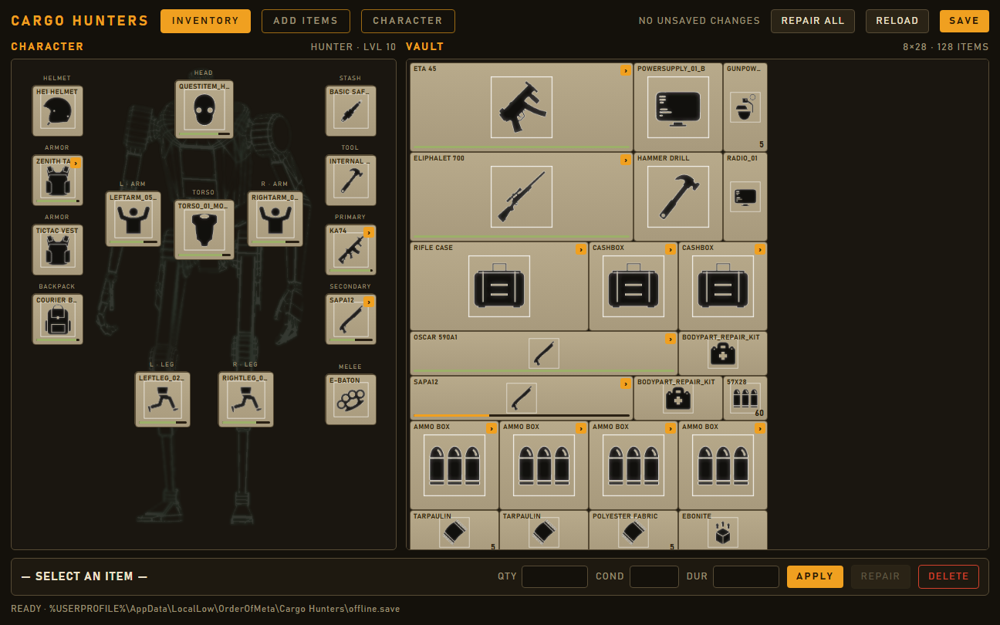
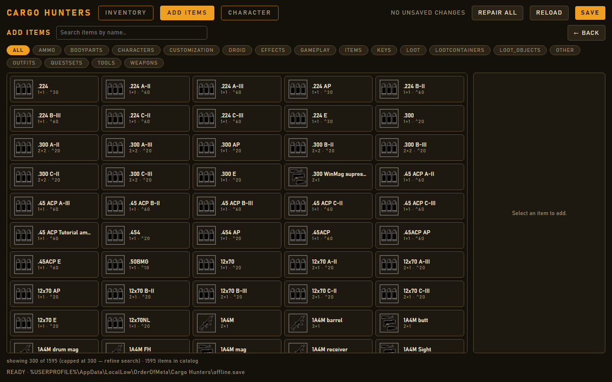
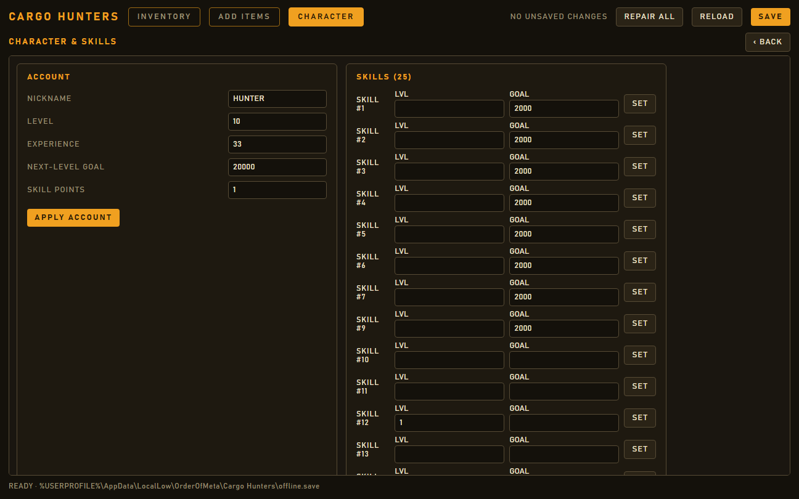
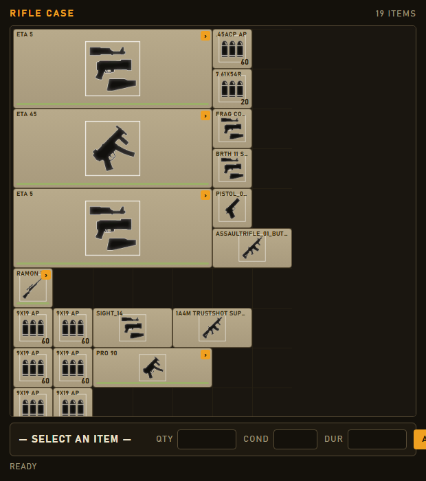

# Cargo Hunters Save Editor

A local, offline desktop editor for the Cargo Hunters `offline.save`. It shows a
Tarkov-style screen — the robot's body parts laid out on a paperdoll silhouette
with worn gear in side rails, and the stash on an accurate grid — and lets you:

- edit any item's stack quantity, condition, and durability;
- repair / refill / top-off items in one click;
- move items on the grid (drag-and-drop), split stacks, delete items;
- add any catalog item to a chosen container;
- edit character nickname, level, XP, skill points, and per-skill levels.

Edits are **staged in memory** — nothing is written until you press **SAVE**,
which makes a timestamped backup, writes atomically, and then re-reads the file
to verify your changes landed before clearing the unsaved indicator.

It's built with [Tauri 2](https://tauri.app) (a Rust core + a web UI) and ships
as a single Windows `.exe` running on the WebView2 runtime that ships with
Windows 10/11.

## Screenshots

| Inventory (paperdoll + vault) | Add items |
| --- | --- |
|  |  |

| Character &amp; skills | Container pop-out |
| --- | --- |
|  |  |

(Screenshots use a demo save; account name and paths are anonymized.)

## Quick start (standalone)

1. Close Cargo Hunters before editing your save.
2. Install via `Cargo Hunters Save Editor_x64-setup.exe` (NSIS) or the `.msi`,
   or run the portable `app.exe`. No Python, no dependencies — just WebView2,
   which is already present on Windows 10/11.
3. It loads your save automatically from
   `%USERPROFILE%\AppData\LocalLow\OrderOfMeta\Cargo Hunters\offline.save`.
4. Switch between **INVENTORY**, **ADD ITEMS**, and **CHARACTER** with the tabs.
5. Make edits, then press **SAVE**. Backups are written next to the save as
   `offline.save.<timestamp>.bak` (the newest 20 are kept).

## Building from source

Prerequisites: Rust (stable, MSVC toolchain), Node.js, and the MSVC C++ build
tools (for the Windows linker). Then, from `app/`:

```pwsh
npm install
npm run tauri dev      # run in development (hot reload)
npm run tauri build    # produce app.exe + installers under src-tauri/target/release
```

## Repository layout

| Path | What |
| --- | --- |
| `app/engine/` | `ch_engine` — the pure-Rust save engine (load/save, model, mutations). No UI deps. |
| `app/src-tauri/` | The Tauri app: thin command wrappers over the engine + the editing session. |
| `app/src/` | The SolidJS/TypeScript frontend (paperdoll, vault grid, catalog browser, character panel). |
| `app/public/sprites/` | Game icon + rig sprites; `BodyHUD.png` is the paperdoll silhouette. |
| `all_items_detailed.csv` | The item catalog, embedded into the exe at build time. |
| `save_io.py` | The original Python engine, kept **only as a differential test oracle** (see below). |
| `extract_*.py`, `refresh_*.py` | Source-only catalog/icon refresh tools (need UnityPy + Pillow). |

## How correctness is guaranteed

The one job this tool must never get wrong is corrupting a save. Two mechanisms
enforce that:

- **Byte-faithful writes.** The engine preserves every untouched number exactly
  as the game wrote it (no float reformatting, no large-integer loss) and keeps
  key order, so a load→save round-trip changes only what you edited.
- **A differential oracle.** The new Rust engine is checked against the
  battle-tested original Python engine: harnesses apply identical operations to a
  real save through both and assert the results match. See
  `app/engine/tests/oracle.py` and `app/engine/tests/op_oracle.py`.

## Safety notes

- Always close the game before saving edits.
- The editor keeps timestamped `.bak` backups; if anything looks wrong, restore
  the most recent one.
- This is a community tool, not affiliated with the game's developers.
