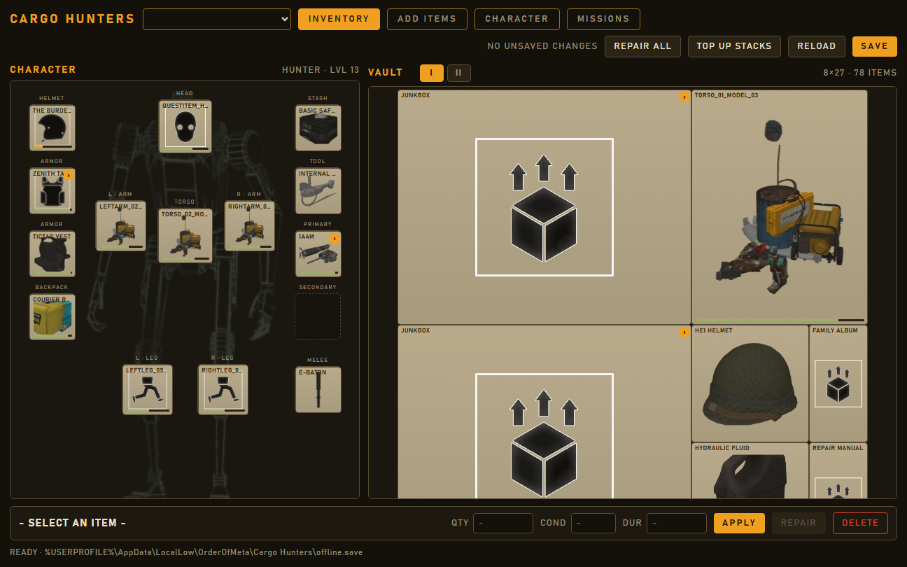
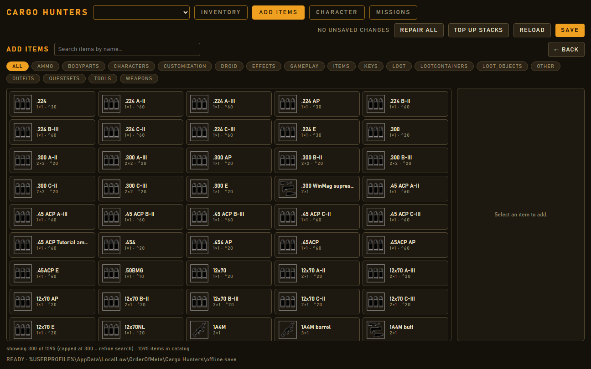
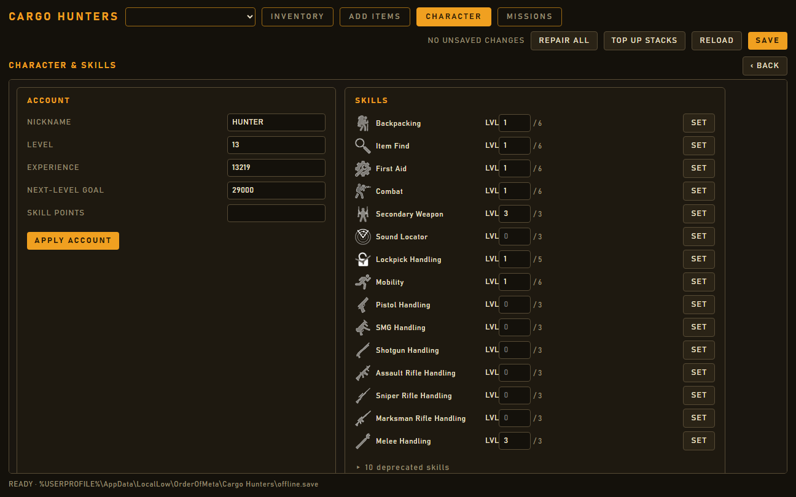
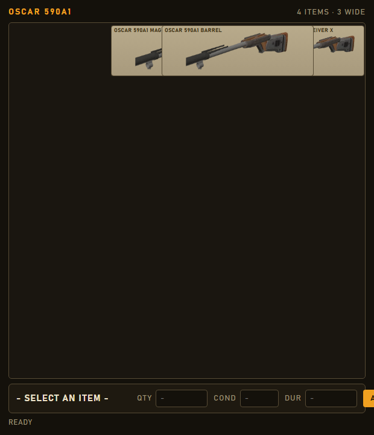
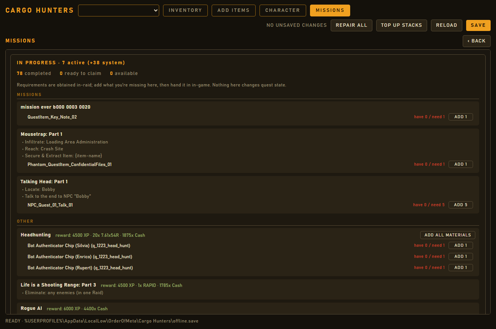

# Cargo Hunters Save Editor

A local, offline desktop editor for the Cargo Hunters `offline.save`. It shows a
Tarkov-style screen - the robot's body parts laid out on a paperdoll silhouette
with worn gear in side rails, and the stash on an accurate grid - and lets you:

- edit any item's stack quantity, condition, and durability (on any item, even
  one with no stats yet);
- repair / refill / top-off a single item - or **everything at once** - and
  **top up every stack** to its max;
- move items on the grid (drag-and-drop), split stacks, delete items;
- **box-select** (drag a rubber-band) or **ctrl-click** multiple items, then
  bulk repair / delete; **right-click** any item to copy / paste / delete
  (copy/paste includes a container's full contents);
- browse the stash across its **inventory pages** (the game's I / II tabs) and
  move items between pages;
- open containers (cases, weapons, ammo boxes) in their own **pop-out windows**;
- add any catalog item to a chosen container;
- edit character nickname, level, XP, skill points, and per-skill levels -
  skills are shown by **name and icon** with their current/max level;
- **decipher in-progress missions** (the save only stores opaque IDs): see each
  mission's objectives and required materials with live have/need counts, and
  add the materials you're missing so you can hand them in in-game.

Edits are **staged in memory** - nothing is written until you press **SAVE**,
which makes a timestamped backup, writes atomically, and then re-reads the file
to verify your changes landed before clearing the unsaved indicator.

It's built with [Tauri 2](https://tauri.app) (a Rust core + a web UI) and ships
as a single Windows `.exe` running on the WebView2 runtime that ships with
Windows 10/11.

## Screenshots

| Inventory (paperdoll + vault) | Add items |
| --- | --- |
|  |  |

| Character &amp; skills | Container pop-out |
| --- | --- |
|  |  |

| Missions (decipher + add materials) | |
| --- | --- |
|  | |

(Screenshots use a demo save; account name and paths are anonymized.)

## Quick start (standalone)

1. Close Cargo Hunters before editing your save.
2. Install via `Cargo Hunters Save Editor_x64-setup.exe` (NSIS) or the `.msi`,
   or run the portable `app.exe`. No Python, no dependencies - just WebView2,
   which is already present on Windows 10/11.
3. It loads your save automatically from
   `%USERPROFILE%\AppData\LocalLow\OrderOfMeta\Cargo Hunters\offline.save`.
4. Switch between **INVENTORY**, **ADD ITEMS**, **CHARACTER**, and **MISSIONS**
   with the tabs.
5. Make edits, then press **SAVE**. Backups are written next to the save as
   `offline.save.<timestamp>.bak` (the newest 20 are kept).

## Building from source

Prerequisites: Rust (stable, MSVC toolchain), Node.js, and the MSVC C++ build
tools (for the Windows linker). Then, from `app/`:

```pwsh
npm install
npm run tauri dev      # run in development (hot reload)
npm run tauri build    # produce app.exe + installers under src-tauri/target/release
```

## Repository layout

| Path | What |
| --- | --- |
| `app/engine/` | `ch_engine` - the pure-Rust save engine (load/save, model, mutations). No UI deps. |
| `app/src-tauri/` | The Tauri app: thin command wrappers over the engine + the editing session. |
| `app/src/` | The SolidJS/TypeScript frontend (paperdoll, vault grid, catalog browser, character panel). |
| `app/public/sprites/` | Game icon + rig sprites; `BodyHUD.png` is the paperdoll silhouette. |
| `all_items_detailed.csv` | The item catalog, embedded into the exe at build time. |
| `quests_catalog.json` | Mission catalog (names, categories, rewards, objectives), embedded at build time. |

## How correctness is guaranteed

The one job this tool must never get wrong is corrupting a save. Two mechanisms
enforce that:

- **Byte-faithful writes.** The engine preserves every untouched number exactly
  as the game wrote it (no float reformatting, no large-integer loss) and keeps
  key order, so a load→save round-trip changes only what you edited.
- **A validated save.** Saving writes a timestamped backup, writes atomically,
  then re-reads the file from disk and confirms it matches the staged edits
  before clearing the unsaved indicator.

The engine has unit tests (`cargo test` in `app/engine`) covering the
byte-faithful serializer, round-trip idempotency, and the edit operations.
During the rewrite the Rust engine was additionally verified against the
original Python engine with a byte-for-byte differential oracle; that scaffolding
has been removed now that the port is complete (it remains in git history).

## Roadmap / future plans

- **Code signing.** Releases are currently **unsigned**, so Windows SmartScreen
  may warn on first run ("Windows protected your PC" → *More info* → *Run
  anyway*). Signing with a code-signing certificate is a possible future step.
- **Cross-window item drag.** Container pop-outs support drag-to-reposition
  within a window; dragging an item *between* windows isn't possible with the
  WebView, so moving items across containers will get a dedicated action.
- **Shelter storage** view (the engine already handles it; the UI hides it).

## Safety notes

- Always close the game before saving edits.
- The editor keeps timestamped `.bak` backups; if anything looks wrong, restore
  the most recent one.
- This is a community tool, not affiliated with the game's developers.

## Credits

This project began as a fork of
[**matziq/cargo-hunters-save-editor**](https://github.com/matziq/cargo-hunters-save-editor),
the original Cargo Hunters save editor. Huge thanks to that project - its
save-format work is the foundation everything here is built on, and during the
rewrite its Python engine served as the differential test oracle that proved the
new Rust engine byte-for-byte correct.

This version is a **complete rewrite and a major departure** from the original:
where the upstream is a Python/Tkinter tool, this is a ground-up
[Tauri](https://tauri.app) (Rust + web) rebuild with a brand-new game-styled,
Tarkov-like UI (robot paperdoll, accurate grid, container pop-outs) and a Rust
save engine verified against the original. It remains under the upstream
project's license (see `LICENSE`).
